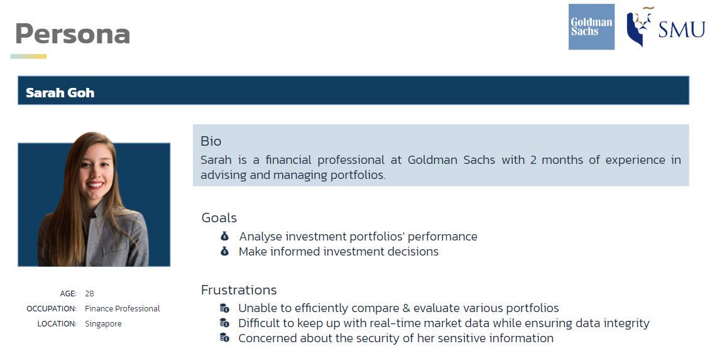
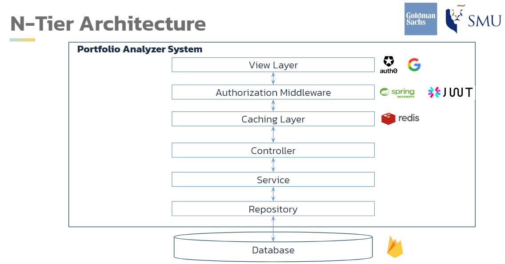
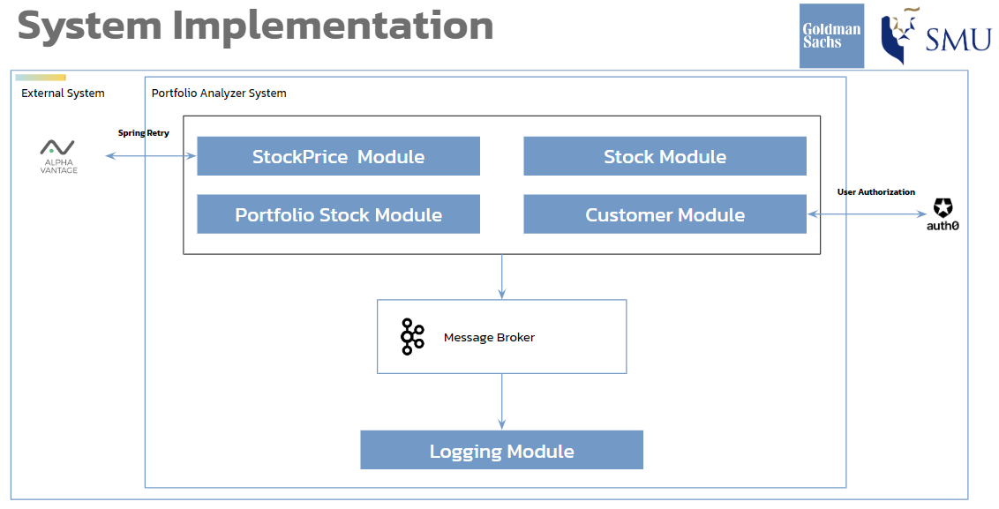
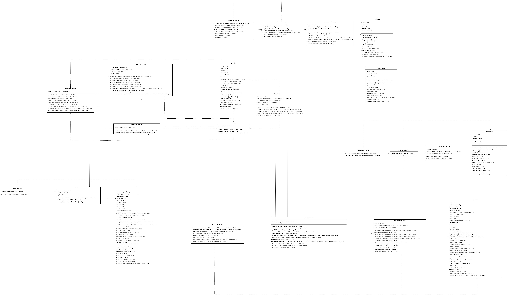

<div align="center">
  
  <p>
    This outlines the project code base for AY2023/2024 Semester 1 IS442 OOP - G1T5
  </p>
</div>

**Kindly refer to this [slide deck](./G1T5.pptx) for more information.**
We have also prepared [Javadocs](./javadocs/index.html) for your convenience!

<details id="table-of-contents">
    <summary>Table of Contents</summary>
    <ol>
        <li>
            <a href="#frontend-repository">Frontend Repository</a>
        </li>
        <li>
            <a href="#about-the-project">About the Project</a>
        </li>
        <li>
            <a href="#features">Features</a>
        </li>
        <li>
            <a href="#system-design">System Design</a>
            <ul>
                <li>
                    <a href="#n-tier-architecture">N-Tier Architecture</a>
                </li>
                <li>
                    <a href="#system-implementation">System Implementation</a>
                </li>
                <li>
                    <a href="#uml-diagram">UML Diagram</a>
                </li>
            </ul>
        </li>
        <li>
            <a href="#built-with">Built with</a>
            <ul>
                <li>
                    <a href="#frontend">Frontend</a>
                </li>
                <li>
                    <a href="#backend">Backend</a>
                </li>
            </ul>
        </li>
        <li>
            <a href="#getting-started">Getting Started</a>
            <ul>
                <li>
                    <a href="#prerequisites">Prerequisites</a>
                </li>
                <li>
                    <a href="#usage">Usage</a>
                </li>
            </ul>
        </li>
        <li>
            <a href="#acknowledgements">Acknowledgements</a>
        </li>
    </ol>
</details>
<br/>

## Frontend Repository
https://github.com/xuanli286/IS442-FRONTEND 👈

## About the Project
<p style="text-align: justify;">
    Our project's client is <b>Goldman Sachs</b>, a leading global financial institution. 
    The objective of our application is to aid investment advisors and finance professionals, like <em>Sarah Goh</em>, in analysing investment portfolios' performance and making informed investment decisions.
</p>
<div align="center">
    
</div>
<p align="right">(<a href="#table-of-contents">back to top</a>)</p>

## Features
<ol>
    <li>Create, update and delete your portfolios</li>
    <li>View your profile details</li>
    <li>View other users' public portfolios</li>
    <li>
        Overall analysis of all your portfolios
        <ul>
            <li>Metrics: Total value, P&L, Buying Power, and Daily P&L</li>
            <li>Ranking by Porfolio Value</li>
            <li>Performance: Monthly/Quarterly</li>
            <li>Market Exposure by Sector</li>
            <li>Country Exposure by Sector</li>
        </ul>
    </li>
    <li>
        Individual portfolio analysis (of your porfolios and community portfolios)
        <ul>
            <li>Portfolio Metrics: Portfolio value, P&L, Buying Power, and Daily P&L</li>
            <li>Portfolio Stocks</li>
            <li>Market Exposure by Sector</li>
            <li>Fluctuations in Stock Prices</li>
            <li>Company Overview and Financials</li>
        </ul>
    </li>
    <li>
        User logs that records
        <ul>
            <li>Creation, update, or deletion of a portfolio</li>
            <li>A change in stock quantities</li>
        </ul>
    </li>
</ol>
<p align="right">(<a href="#table-of-contents">back to top</a>)</p>

## System Design
### N-Tier Architecture
<div align="center">
	
</div>

### System Implementation
<div align="center">
	
</div>

### UML Diagram
<a href="https://drive.google.com/file/d/1_DcWD0vo612p91lRy6k6_O9ijme_1JFq/view?usp=sharing">draw.io</a>
<div align="center">
	
</div>
<p align="right">(<a href="#table-of-contents">back to top</a>)</p>


## Built with

### Frontend
<ul>
    <li>
        <a href="https://vuejs.org">Vue.js</a>
    </li>
    <li>
        <a href="https://tailwindcss.com/">Tailwind CSS</a>
    </li>
    <li>
        <a href="https://pinia.vuejs.org/">Pinia</a>
    </li>
</ul>

### Backend
<ul>
    <li>
        <a href="https://www.java.com/en/">Java</a>
    </li>
    <li>
        <a href="https://maven.apache.org/index.html">Apache Maven</a>
    </li>
    <li>
        <a href="https://spring.io/projects/spring-boot">Spring Boot</a>
    </li>
    <li>
        <a href="https://github.com/microsoftarchive/redis/releases/tag/win-3.2.100">Redis</a>
    </li>
    <li>
        <a href="https://firebase.google.com/">Firebase</a>
    </li>
</ul>

<p align="right">(<a href="#table-of-contents">back to top</a>)</p>


## Getting Started

### Prerequisites
<ul>
    <li>
        <a href="https://nodejs.org/en">Node.js 18.17.1</a>
    </li>
    <li>
        <a href="https://maven.apache.org/install.html">Apache Maven 3.2.0</a>
    </li>
    <li>
        <a href="https://github.com/microsoftarchive/redis/releases/tag/win-3.2.100">Redis 3.2.1</a>
    </li>
</ul>

### Usage

1. Open the IS442-FRONTEND folder
2. Install required dependencies

```
npm install
```
3. Run the Frontend

```
npm run serve
```
4. Open the Redis folder
5. Click on the redis-cli.exe to run the Redis server

6. Open the IS442-REST-API folder
7. Run backend

```
mvn spring-boot:run
```

<p align="right">(<a href="#table-of-contents">back to top</a>)</p>


## Acknowledgements
* [Low Xuanli](https://github.com/xuanli286)
* [Mohammad Fadhli Bin Abdul Nassir](https://github.com/mohammadfadhli)
* [Rachel Sng Yue Wei](https://github.com/rrachea)
* [Sioh Rui En, Regine](https://github.com/ruigine)
* [Tan Li Xuan Germaine](https://github.com/germainetan)
* [Tan Yi Peng](https://github.com/tanyipeng834)
<p align="right">(<a href="#table-of-contents">back to top</a>)</p>